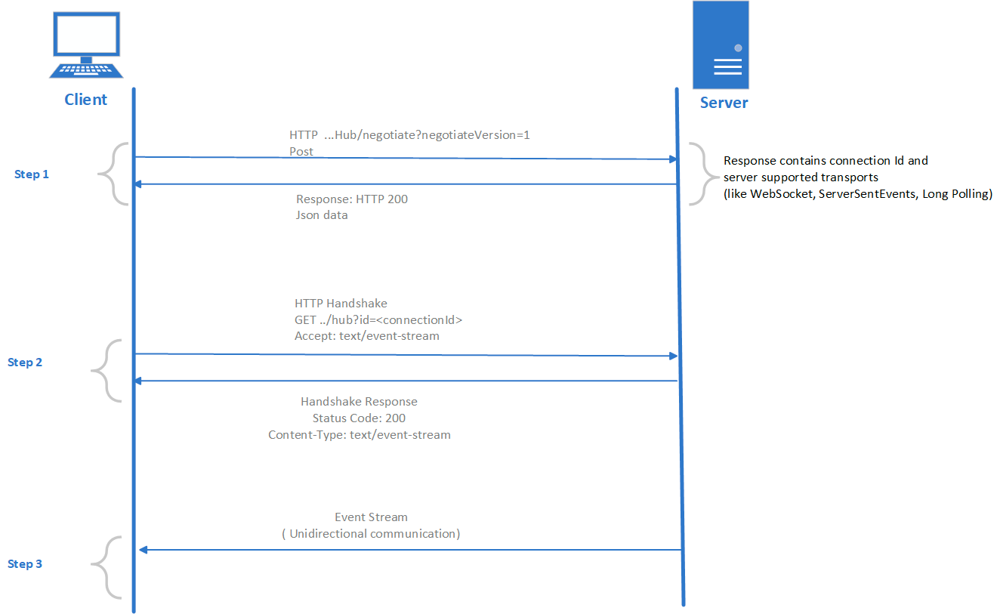

## Server-Sent Events (SSE)

SSE is a server push technology enabling a client to receive automatic updates from a server via HTTP connection. The SSE uses the EventSource object. EventSource creates a connection from the server to the client. Once the connection is established, the server can send the data to the client anytime using this connection. SSE is supported on all browsers, except Internet Explorer. SSE is unidirectional (Server to the client). We can use SSE for status updates, news feeds, etc. required from the server.

More information about EventSource is available [here](https://developer.mozilla.org/en-US/docs/Web/API/EventSource).

